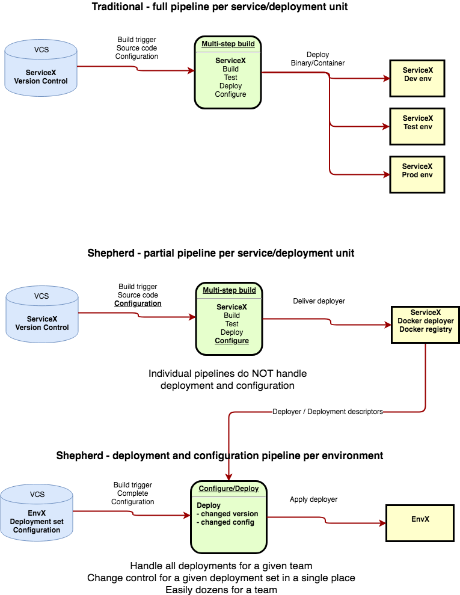

# Shepherd
## Deployment manager with docker

Shepherd is a configuration and deployment management tool through Docker. Target use is controlling configuration and deployment of infrastructure, databases and microservices using version control, at the appropriate granularity. 

Capturing and controlling configuration of infrastructure and microservices across multiple environments in as
simple manner as possible, with minimal impact on the independent deployability of microservices. 

## Goals

The first goal of Shepherd is to enable solid configuration management of software deployments at the appropriate granularity,
without deciding too much what that granularity is. The objective is to be able to configure multiple deployments
together, with focus on capturing difference between environments on the development lifecycle axis (dev, test, stage, etc...),
as well as other axis, such as availability regions or customers.

Another goal is to enable simple deployment of an arbitrary number of components (or services) in a single action, supporting
another goal of good software architecture as defined in "Clean Archtecture": 

"To be effective, a software system must be deployable. The higher the cost of deployment, the less useful the system is.
A goal of a software architecture then, should be to make a system that can be easily deployed _with a single action_." 
(Robert C. Martin - Clean Architecture)

Yet another goal is to lessen the dependency of your deployment pipeline on specific version control tools and build tools/CI-CD servers, hence opening the option of switching those tools more easily. 

## Principles

- Minimize code in configuration projects in version control. Only __volatile__ code/declarations should be in configuration projects.
- Minimize dependencies. Make the tool VCS and CI tool agnostic. Shepherd is normally set up and run using a VCS/CI server
combination, such as Github/Jenkins.
- Encourage/enforce binary promotion practices.
- Support any deployment technology runnable in Docker containers, which should be pretty much everything that can
be run headless.

# Agent
The only operational component is the [agent](agent/README.md)

# Server
[Server](server/README.md) is work in progress. API for agent and web, and web server for web.
 
# Web

Single-page [web app](web/README.md)  UI for deployment management, work in progress.

# Glossary

1. ___Volatility___ in this context relates mostly to two concerns, items that are already different between two deployments
(for example, deployment name, customer name, environment name or domain names), or items that are
not under the team's control, such as references to external API endpoints, domains of external parties,
names of companies, and so on. 

# Todo

1. Code cleanup...remove script leftovers from toolchain. Code reorg?
1. Increase flexibility regarding location of /deployments/central/images.yaml. 
1. Support hierarchical folder/herd structure, with each dir adding env variables to those defined higher up.
1. Support rollback to last version. See ideas below.
1. Command line tools - installer - inspection of image metadata
1. Feature deployment using namespaces/external names.
1. Layered configuration to better support multiple deployment sets.
1. More flexible configuration setup using YAML, especially regarding testing, location of test reference files and test environment.
1. Support deployer remove/delete.
1. Read-only UI - see web/balsamiq-prototype.
1. Configurable storage backend for images.yaml? Currently assuming CI/CD tool + version control
for access control, and running deployments, which requires a bit of setup and may not be intuitive for everyone.
To lower adoption threshold, may make sense to have a (API) server that supports this.
1. Extract route53 sync project and make separate.
1. Support confirmation in deployment tools that have that concept, like Terraform.

## Rollback support
a. Optimal if we can detect rollback in version committed to VCS. In this case, if a container supports rollback (has label
indicating rollback support), call the CURRENT version of the deployment container with a rollback call with the version being
rolled back to as a parameter.

Workflow:

a. Running version 10 already deployed.
b. New version of deployer specified in images.yaml ( or dependency pulled in ) has a lower version (9).
      Version order is determined by comparing each numeric values from version string and doing a numeric
      comparison. Hence v10.10.999 is older than v11.1.1
c. Shepherd calls current running version with parameters ROLLBACK and TARGET_VERSION=9
d. Now, the question is, do we need to call the "new" version with up? Probably not.

## License
This software is released under the GNU - General Public License
[License](./COPYING)

## Copyright
- Copyright Icelandair 2017-2018
- Copyright Kolibri 2018